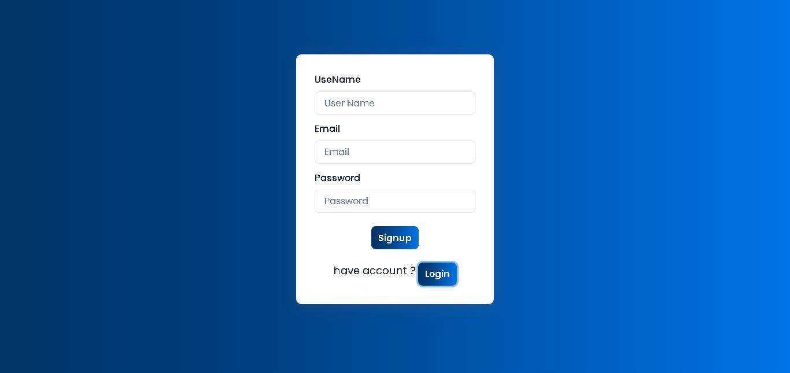
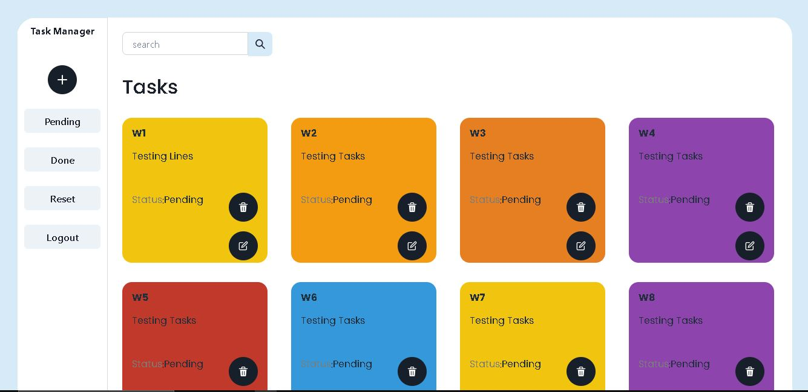
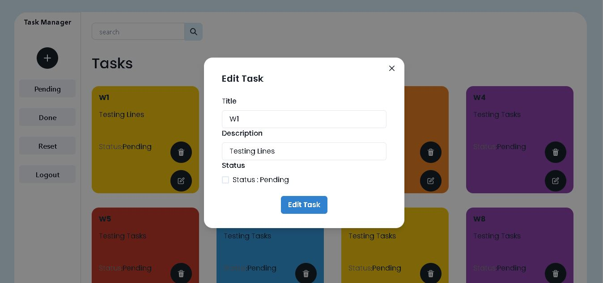
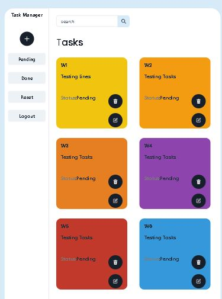
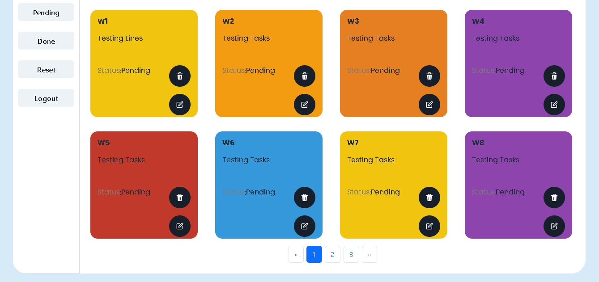

# Task-Manager

TaskMaster is a versatile task management application designed to help individuals and teams organize, prioritize, and track their tasks efficiently.

## Features

-
- **Task Creation**: Easily create new tasks with titles, descriptions, and status.
- **Task Editing**: Update task details including title, description, and status as needed.
- **Task Deletion**: Remove tasks from the list when they are no longer relevant or necessary.
- **Status-Based Filtering**: Filter tasks based on their status, allowing users to focus on pending or completed tasks.
- **Customizable Task Views**: Customize task views based on priority, deadline, or any other criteria to suit individual preferences.
- **Secure Data Management**: Ensures the confidentiality and security of task data with robust data management protocols.
- **Login/Signup Authentication**: Users can create accounts, log in, and securely access their tasks with authentication features.


## Screenshots
   
   
   
   
   
   
   

## Frontend

### Technologies Used

- **React**: Frontend framework for building user interfaces.
- **Ant Design with Chakra UI**: UI component libraries for designing a modern and responsive UI.
- **Redux**: State management library for managing application state.
- **Redux Thunk**: Middleware for handling asynchronous actions in Redux.
- **React Router DOM**: Library for handling routing in React applications.
- **Local Storage**: Browser storage for storing user data locally.
- **Responsive Pagination**: Pagination component for navigating through lists of tasks on different devices.

### Folder Structure

```frontend/
│
├── src/
│ ├── Components/
│ ├── Redux/
│ ├── App.js
│ ├── index.js
│ └── ...
│
└── README.md```


## Backend

### Technologies Used

- **Node.js**: JavaScript runtime for building scalable network applications.
- **Express**: Web application framework for Node.js for building APIs and handling HTTP requests.
- **MongoDB**: NoSQL database for storing task data.
- **Email Validate**: Library for validating email addresses.

### Folder Structure

backend/
│
│
│
├── Models/
│ ├── taskModel.js
│ └── ...
│
├── Router/
│ ├── taskRoutes.js
│ └── ...
│__index.js


## Usage

1. Clone the repository.
2. Navigate to the frontend and backend directories separately.
3. Install dependencies using `npm install`.
4. Start the frontend and backend servers using `npm start`.
5. Access the application via the provided URL.


## Frontend Deplyed Link

- https://task-manager-mu-ten.vercel.app/tasks?page=1

## Backend Deployed Link

- https://task-manager-0ygk.onrender.com/
